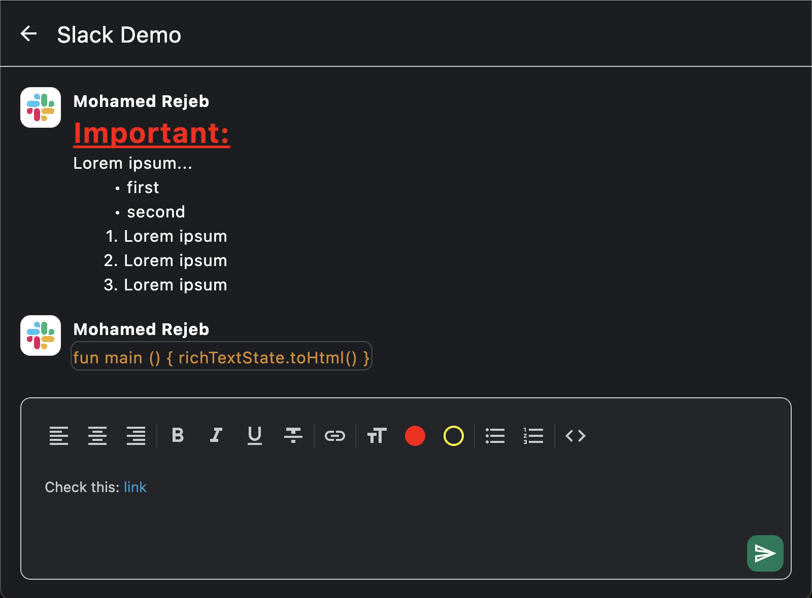

<h1 align="center">Compose Rich Editor</h1><br>

[](http://kotlinlang.org)
[](https://www.jetbrains.com/lp/compose-multiplatform)
[](https://github.com/MohamedRejeb)
[](https://opensource.org/licenses/Apache-2.0)
[](https://android-arsenal.com/api?level=21)
[](https://search.maven.org/search?q=g:%22com.mohamedrejeb.richeditor%22%20AND%20a:%22richeditor-compose%22)


A rich text editor library for both Jetpack Compose and Compose Multiplatform, fully customizable and supports the common rich text editor features

- **Multiplatform**: Compose Rich Editor supports Compose Multiplatform (Android, iOS, Desktop, Web).
- **Easy to use**: Compose Rich Editor's API leverages Kotlin's language features for simplicity and minimal boilerplate.
- **WYSIWYG**: Compose Rich Editor is a WYSIWYG editor that supports the most common text styling features.



## Download

[](https://search.maven.org/search?q=g:%22com.mohamedrejeb.richeditor%22%20AND%20a:%22richeditor-compose%22)

Compose Rich Editor is available on `mavenCentral()`.

```kotlin
implementation("com.mohamedrejeb.richeditor:richeditor-compose:1.0.0-rc08")
```

## Compatibility

[](https://search.maven.org/search?q=g:%22com.mohamedrejeb.richeditor%22%20AND%20a:%22richeditor-compose%22)

| Kotlin version | Compose version | Compose Rich Editor version |
|----------------|-----------------|-----------------------------|
| 2.0.20         | 1.6.11          | 1.0.0-rc08                  |
| 2.0.10         | 1.6.11          | 1.0.0-rc06                  |
| 2.0.0          | 1.6.10          | 1.0.0-rc05-k2               |
| 1.9.24         | 1.6.10          | 1.0.0-rc05                  |

## Quick Start

#### RichTextState

Use `RichTextEditor` composable to create a rich text editor.

The `RichTextEditor` composable requires a `RichTextState` to manage the editor's state.

To create a `RichTextState`, use the `rememberRichTextState` function:

```kotlin
val state = rememberRichTextState()

RichTextEditor(
    state = state,
)
```

#### Styling Spans

To style spans, `RichTextState` provides `toggleSpanStyle` method:

```kotlin
// Toggle a span style.
richTextState.toggleSpanStyle(SpanStyle(fontWeight = FontWeight.Bold))
```

To get the current span style of the selection, use `RichTextState.currentSpanStyle`:

```kotlin
// Get the current span style.
val currentSpanStyle = richTextState.currentSpanStyle
val isBold = currentSpanStyle.fontWeight = FontWeight.Bold
```

#### Styling Paragraphs

To style paragraphs, `RichTextState` provides `toggleParagraphStyle` method:

```kotlin
// Toggle a paragraph style.
richTextState.toggleParagraphStyle(ParagraphStyle(textAlign = TextAlign.Center))
```

To get the current paragraph style of the selection, use `RichTextState.currentParagraphStyle`:

```kotlin
// Get the current paragraph style.
val currentParagraphStyle = richTextState.currentParagraphStyle
val isCentered = currentParagraphStyle.textAlign = TextAlign.Center
```

#### Add links

To add links, `RichTextState` provides `addLink` method:

```kotlin
// Add link after selection.
richTextState.addLink(
    text = "Compose Rich Editor",
    url = "https://github.com/MohamedRejeb/Compose-Rich-Editor"
)
```

To get if the current selection is a link, use `RichTextState.isLink`:

```kotlin
// Get if the current selection is a link.
val isLink = richTextState.isLink
```

By default, links will be opened by your platform's `UriHandler`, if however you want to
handle the links on your own, you can override the composition local as such:

```kotlin
val myUriHandler by remember {
    mutableStateOf(object : UriHandler {
        override fun openUri(uri: String) {
            // Handle the clicked link however you want
        }
    })
}
CompositionLocalProvider(LocalUriHandler provides myUriHandler) {
    RichText( ... )
}
```

#### Add Code Blocks

To add code blocks, `RichTextState` provides `toggleCodeSpan` method:

```kotlin
// Toggle code span.
richTextState.toggleCodeSpan()
```

To get if the current selection is a code block, use `RichTextState.isCodeSpan`:

```kotlin
// Get if the current selection is a code span.
val isCodeSpan = richTextState.isCodeSpan
```

#### Ordered and Unordered Lists

You can add ordered and unordered lists using `RichTextState`:

```kotlin
// Toggle ordered list.
richTextState.toggleOrderedList()

// Toggle unordered list.
richTextState.toggleUnorderedList()
```

You can get if the current selection is an ordered or unordered list, using `RichTextState`:

```kotlin
// Get if the current selection is an ordered list.
val isOrderedList = richTextState.isOrderedList

// Get if the current selection is an unordered list.
val isUnorderedList = richTextState.isUnorderedList
```

#### Customizing the rich text configuration

Some of the rich text editor's features can be customized, such as the color of the links and the code blocks.

```kotlin
richTextState.config.linkColor = Color.Blue
richTextState.config.linkTextDecoration = TextDecoration.Underline
richTextState.config.codeSpanColor = Color.Yellow
richTextState.config.codeSpanBackgroundColor = Color.Transparent
richTextState.config.codeSpanStrokeColor = Color.LightGray
```

#### HTML import and export

To convert HTML to `RichTextState`, use `RichTextState.setHtml` method:

```kotlin
val html = "<p><b>Compose Rich Editor</b></p>"
richTextState.setHtml(html)
```

To convert `RichTextState` to HTML, use `RichTextState.toHtml` method:

```kotlin
val html = richTextState.toHtml()
```

#### Markdown import and export

To convert Markdown to `RichTextState`, use `RichTextState.setMarkdown` method:

```kotlin
val markdown = "**Compose** *Rich* Editor"
richTextState.setMarkdown(markdown)
```

To convert `RichTextState` to Markdown, use `RichTextState.toMarkdown` method:

```kotlin
val markdown = richTextState.toMarkdown()
```

Check out Compose Rich Editor's [full documentation](https://mohamedrejeb.github.io/Compose-Rich-Editor/) for more details.

## Web live demo
You can try out the web demo [here](https://compose-richeditor.netlify.app/).

## Contribution
If you've found an error in this sample, please file an issue. <br>
Feel free to help out by sending a pull request :heart:.

[Code of Conduct](https://github.com/MohamedRejeb/Compose-Rich-Editor/blob/main/CODE_OF_CONDUCT.md)

## Find this library useful? :heart:
Support it by joining __[stargazers](https://github.com/MohamedRejeb/Compose-Rich-Editor/stargazers)__ for this repository. :star: <br>
Also, __[follow me](https://github.com/MohamedRejeb)__ on GitHub for more libraries! 🤩

You can always <a href="https://www.buymeacoffee.com/MohamedRejeb" target="_blank"></a>

# License
```markdown
Copyright 2023 Mohamed Rejeb

Licensed under the Apache License, Version 2.0 (the "License");
you may not use this file except in compliance with the License.
You may obtain a copy of the License at

   http://www.apache.org/licenses/LICENSE-2.0

Unless required by applicable law or agreed to in writing, software
distributed under the License is distributed on an "AS IS" BASIS,
WITHOUT WARRANTIES OR CONDITIONS OF ANY KIND, either express or implied.
See the License for the specific language governing permissions and
limitations under the License.
```
